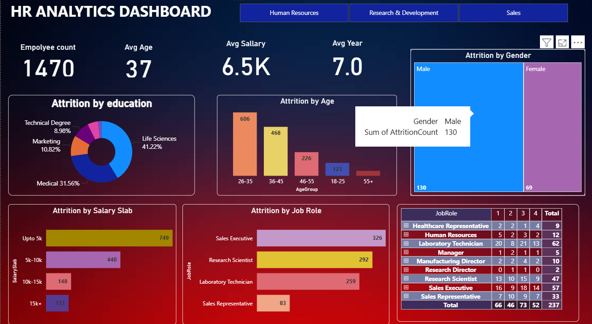

# HR Analytics Dashboard

## Overview
This project provides an interactive HR Analytics Dashboard built using Power BI. It helps organizations analyze employee attrition and key HR metrics to make data-driven decisions.

## Features
- **Employee Count, Avg Age, Avg Salary, Avg Year**: Key HR metrics at a glance.
- **Attrition by Education**: Visualizes attrition rates across different education backgrounds.
- **Attrition by Age**: Shows attrition distribution by age groups.
- **Attrition by Gender**: Compares attrition between male and female employees.
- **Attrition by Salary Slab**: Highlights attrition across salary ranges.
- **Attrition by Job Role**: Displays attrition by various job roles.
- **Detailed Table**: Provides a breakdown of attrition by job role and other factors.

## Files
- `HR analytics(attrition).pbix`: Power BI dashboard file.
- `HR_Analytics.csv`: Source data for the dashboard.
- `Dashboard.png`: Screenshot of the dashboard.

## How to Use
1. Open `HR analytics(attrition).pbix` in Power BI Desktop.
2. Load the data from `HR_Analytics.csv` if prompted.
3. Explore the dashboard and interact with the visuals.

## Screenshot

## License
This project is for educational and internal use. Please contact the author for other uses.
# HR-analytics-dashboard
